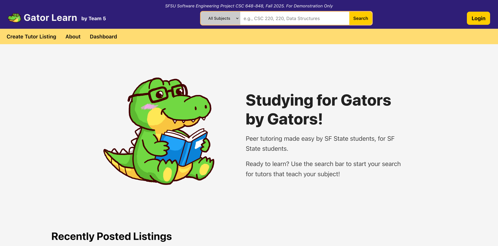

## Technical Overview

This project is a demo production-deployed, full-stack tutoring platform designed to connect SFSU students with tutors 
through a secure, authenticated web application. I led the architecture, engineering, deployment, and delivery of 
the system end-to-end, taking it from concept to a live, publicly accessible application.

The platform supports user authentication, profile management, tutor post, search, and filtering, session workflows, 
and administrative functionality within a structured backend, web analytics, and a scalable cloud infrastructure.

**Home Page**

### Team Members:

|       Student Name        |  GitHub Username  |
|:-------------------------:|:-----------------:|
|      Milo Pesce Ares      |      milo-pa      |
| Samantha Chombo-Rodriguez |      smunthe      |
|       Jonah Hammond       |      jonuuh       |
|      Hill Kalathiya       |      hill13       |
|      Enrique Liganor      |   RainyToaster    |

*Developed as Senior Capstone Project*

## Product & Engineering Documentation

This project was developed using formal software engineering practices, including:
- Functional and non-functional requirements
- Defined user personas and use cases
- UI storyboards and workflow mapping
- Data glossary and relational schema documentation
- Security considerations and deployment notes
- Competitive analysis of existing tutoring platforms

These artifacts informed system architecture decisions and ensured alignment between user needs, 
database design, and production deployment. Full documentation available upon request.

## Tech Stack

**Frontend:**
- React
- JavaScript
- SCSS
- Google Analytics

**Backend:**
- Java
- Spring Boot
- REST APIs

**Database:**
- MySQL

**Infrastructure & DevOps:**
- AWS EC2
- Amazon Linux
- Nginx
- Git & GitHub
- Github Projects